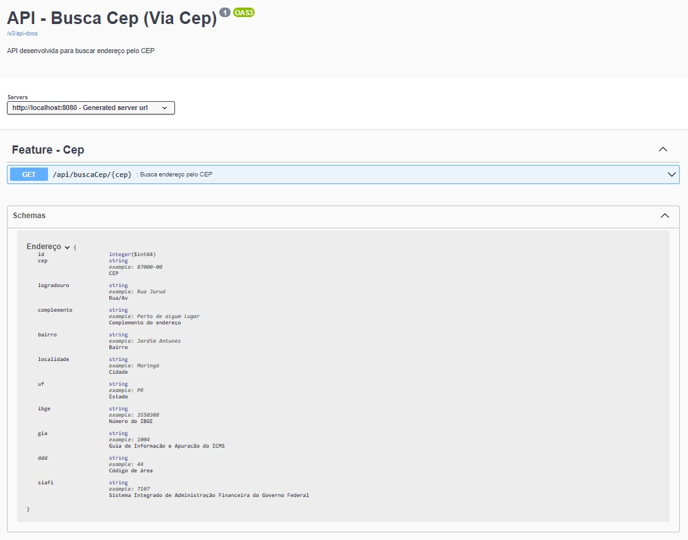

# API Via Cep

---

### 🔷 Resumo

<p> 
Objetivo: Criar uma API que busca o endereço pelo cep e fazer com que não seja realizada requisição para um cep que já foi consultado.
</p>

---

## ⚙️ Como Executar a Aplicação

1. **Pré-requisitos:**
    - Certifique-se de ter o [JDK 17](https://www.oracle.com/java/technologies/downloads/#java17) instalado em seu computador.

2. **Clone o Repositório:**
    - Faça o clone do repositório do projeto para o seu ambiente de desenvolvimento.

3. **Navegue até o Diretório:**
    - Abra o terminal e navegue até o diretório onde se encontra o arquivo `ApiGerenciamentoEscolarApplication.java`.

4. **Compilação:**
    - Compile o arquivo utilizando o seguinte comando:
      ```
      javac ApiGerenciamentoEscolarApplication.java
      ```

5. **Execução:**
    - Após compilar, execute a aplicação com o seguinte comando:
      ```
      java ApiGerenciamentoEscolarApplication.java
      ```

6. **Acesso à Aplicação:**
    - Acesse a aplicação em execução em [http://localhost:8080/api/buscaCep/87045440](http://localhost:8080/api/buscaCep/87045440) no seu navegador.

---

### 📚 Documentação com Swagger

A documentação da API é gerada automaticamente pelo Swagger, facilitando a compreensão e teste das suas rotas. Siga os passos abaixo para acessar a documentação:

1. Certifique-se de que a aplicação esteja em execução.
2. Abra um navegador da web.
3. Acesse o seguinte link: [http://localhost:8080/swagger-ui/index.html#](http://localhost:8080/swagger-ui/index.html#).
4. Na página do Swagger, você verá uma lista de todas as operações disponíveis na sua API, incluindo os detalhes de entrada e saída para cada rota.
5. Clique em uma operação para abrir seus detalhes. Aqui, você pode testar a rota diretamente no navegador, fornecendo os parâmetros necessários e clicando em "Try it out!".

Certifique-se de que a aplicação esteja em execução para que o Swagger possa gerar a documentação corretamente. A documentação do Swagger é uma ferramenta valiosa para desenvolvedores e usuários da API, permitindo entender e testar facilmente as funcionalidades disponíveis.



---

## 🏢 Banco de Dados em Memória H2

A aplicação utiliza o banco de dados em memória H2 para armazenar os dados. Para acessar o console de administração do H2, siga os passos abaixo:

1. Acesse [http://localhost:8080/h2-console](http://localhost:8080/h2-console) no seu navegador.
2. No campo "JDBC URL", coloque `jdbc:h2:mem:dbViacep` (que é a URL de conexão com o banco de dados H2 em memória).
3. No campo "Username", insira `root`.
4. No campo "Password", insira `admin123`.
5. Clique em "Connect" para acessar o console de administração do H2.

Lembre-se de que o banco de dados em memória H2 é reiniciado sempre que a aplicação é reiniciada.

---

## 🧪 Utilização do Redis para Cache

A aplicação utiliza o Redis, um banco de dados em memória, para realizar o cache dos endereços obtidos pelo CEP. Para começar a usar o Redis em sua aplicação, siga os passos abaixo para criar uma instância do Redis usando o Docker:

1. **Instalar o Docker:**
   Certifique-se de ter o Docker instalado em seu sistema. Você pode baixar e instalar o Docker de acordo com o seu sistema operacional. As instruções estão disponíveis no site oficial do Docker: [https://docs.docker.com/get-docker/](https://docs.docker.com/get-docker/).

2. **Abra o Terminal:**
   Abra o terminal ou prompt de comando em seu sistema.

3. **Baixar e Iniciar o Container Redis:**
   Execute o seguinte comando para baixar e iniciar uma instância do Redis:

   ```bash
   docker run -d --name img-redis -p 6379:6379 redis
   
---

## 👨‍💻 Autor

Nome: Guilherme Januário<br>Linkedin: [Guilherme Januário](https://www.linkedin.com/in/guilherme-janu%C3%A1rio/)

---

<h4 align="center">©️ Feito com 💚 por <a href="https://github.com/guiijanuario">Guilherme Januário</a></h4>